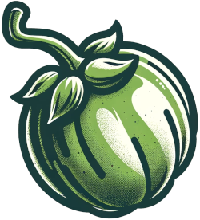

# Rancid Tomatillos 

<!--  -->

# 💻 Tech Stack

# 🧠 Contributors
[Erica Hagle](https://github.com/ericahagle) &
[Bobby Steckline](https://github.com/rjsturing)

# 💭 Abstract
Ready for movie magic but can't choose what to watch? Rancid Tomatillos is your ultimate film finder! Our app offers a vast selection of movies, each with a handy overview and rating. Get a glimpse of genre, runtime, and synopsis on our details page. Embark on your cinematic journey and find your perfect movie match with Rancid Tomatillos!  

# 📝 Context
This application was built as a pair project of Turing School of Software and Design's Front End Web Development program, Mod 3. We were given 12 days, from kick-off, to complete and submit the project for evaluation from scratch using the [provided comp](https://frontend.turing.edu/projects/module-3/rancid-tomatillos-v3.html).

# 🖼️ Preview

# 🔧 Installation Instructions
1. Clone this client repository to your local machine
2. Navigate (`cd`) to your local directory containing the server repository
3. Run `npm install` to install the dependencies
4. Run `npm start` to start the server
5. On your web browser, navigate to http://localhost:3000/
6. Find your new favorite movie!

# 💡 Learning Goals
- Gain competency with React fundamentals
- Test React components & asynchronous JS
- Practice refactoring
- Create a multi-page UX using Router
- Implement responsive design

# Challenges & Wins
## 🚧 Challenges
- Engaging in our initial React project was a challenging but fulfilling experience. We found that this library/framework facilitated faster development compared to using just vanilla JavaScript.
- Having one team member on the East Coast and one one the West Coast presented some scheduling challenges, especially since so much of the project had to be accomplished after school hours. 
- Learning multiple new tools (React, React Router, PropTypes, Cypress, Responsive Design) at about the same time _and_ implementing them all in the project was a challenge, but an excellent learning experience!

## 🌟 Wins
- GitHub Project Board Expertise: Erica's profound knowledge not only simplified and maximized our organizational efforts but also enabled others to effectively utilize the board for improved project management.
- Bobby did amazing work on our page styling, getting really fun bits to work, such as the wiggle of each poster on hover, and the light up marquee!
- This was also our first foray into responsive design. Both Bobby and Erica had a lot of fun tweaking elements of the app to work better on different screen sizes.
- Going in, Erica had previous experience with Cypress. This made it not only easier to get through writing the tests, but also pretty fun. She was also able to help some other folks in our cohort when they got stuck with their tests.
- Efficient Cross-Coast Collaboration: Overcoming the East-West time zone difference, our team's effective communication and collaboration ensured smooth project progress and decision-making.
